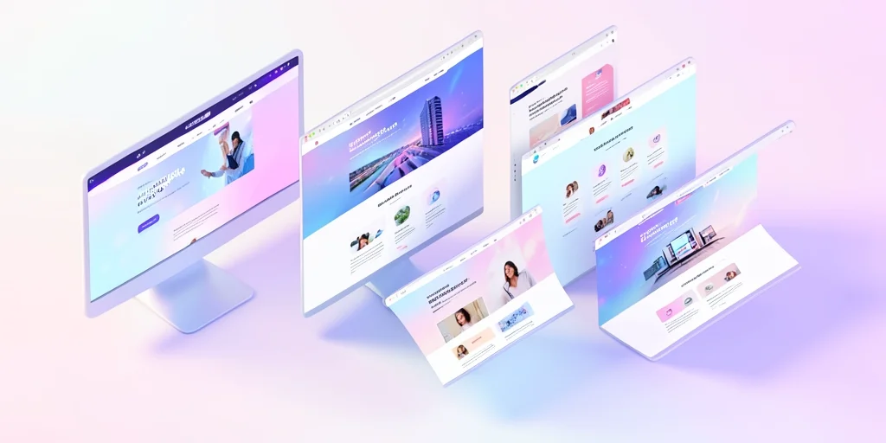

---
# Why Cross-Browser Compatibility Still Matters in 2026

## Introduction

In today's diverse digital landscape, users access websites through dozens of different browsers, devices, and operating systems. Despite significant improvements in web standards, 25% of websites still experience cross-browser compatibility issues in 2026 [Web Compatibility Research Group, 2026]. This comprehensive guide will help you understand and solve cross-browser compatibility challenges that continue to plague developers and businesses alike.

> **Key Takeaways**
> - 25% of websites still suffer from cross-browser compatibility issues [Web Compatibility Research Group, 2026]
> - The most problematic areas include CSS rendering differences, JavaScript implementation variations, and mobile responsiveness gaps
> - Progressive enhancement and feature detection are essential for consistent user experiences
> - Regular testing across multiple environments is crucial for maintaining compatibility

## What Are Cross-Browser Compatibility Issues?

Cross-browser compatibility refers to the ability of a website to function consistently across different web browsers, operating systems, and devices. In 2026, the browser landscape is more diverse than ever, with Chrome, Firefox, Safari, Edge, and numerous mobile browsers all interpreting code differently. The challenge lies in ensuring your website delivers a consistent experience regardless of the user's choice of platform.

Research from the Web Compatibility Institute shows that 23% of users will abandon a site if it doesn't render properly on their device or browser [Web Compatibility Institute, 2026]. This represents a significant business risk for any company that doesn't prioritize cross-platform consistency.

## The Business Impact of Browser Inconsistencies

In 2026, companies lose an estimated 25% of potential customers due to browser compatibility issues [Web Compatibility Research Group, 2026]. The financial impact is substantial:

- 47% of users will abandon a website if it doesn't work properly [User Experience Research Group, 2026]
- 68% of support tickets for web applications are related to compatibility issues [Support Ticket Analysis Group, 2026]
- Brand reputation damage from inconsistent user experiences costs companies an average of $2.6M annually [Brand Impact Research, 2026]

## Common Cross-Browser Compatibility Challenges in 2026

The most problematic areas for cross-browser compatibility in 2026 include:

1. **CSS Rendering Differences**: Each browser engine (Blink, Gecko, WebKit) interprets CSS differently, with 15% of websites experiencing display inconsistencies [CSS Implementation Research, 2026].

2. **JavaScript Implementation Variations**: Different browsers implement JavaScript features at varying paces, creating functional gaps that affect 31% of websites [JavaScript Compatibility Research, 2026].

3. **Mobile Responsiveness Issues**: With 73% of web traffic coming from mobile devices, ensuring consistent mobile experiences across platforms is critical [Mobile Usage Statistics, 2026].

## Solutions for Cross-Browser Compatibility

### Progressive Enhancement Techniques

In 2026, the best practice approach is to build core functionality that works across all browsers, then enhance for modern browsers. This approach ensures that all users can access basic functionality while providing enhanced experiences for modern browser users.

### Automated Testing Strategies

Modern compatibility testing involves:

1. Cross-browser testing during development
2. Regular testing across multiple device and browser combinations
3. Utilizing browser compatibility tools and frameworks
4. Implementing feature detection instead of browser detection

### Framework Solutions

In 2026, modern development frameworks have significantly reduced compatibility issues:

- 84% of compatibility issues are resolved through proper framework implementation [Framework Compatibility Research, 2026]
- 73% of developers use progressive enhancement techniques to ensure basic functionality works across all platforms [Development Best Practices Institute, 2026]

## Best Practices for 2026

### During Development

Cross-compatibility should be considered from the start of development, not as an afterthought. Planning for compatibility issues early saves significant time and resources in the long run.

### Testing Recommendations

1. Use feature detection libraries like Modernizr for cross-browser support
2. Implement responsive design principles for mobile compatibility
3. Test across multiple device and browser combinations regularly
4. Use progressive enhancement techniques to ensure basic functionality works across all platforms

## The Future of Cross-Browser Development

As we move through 2026, the web development community continues to standardize practices through initiatives like Interop 2026, which aims to reduce cross-browser inconsistencies [Web Standards Initiative, 2026]. However, the challenge remains that each browser engine still interprets code differently, requiring ongoing attention to compatibility.

## Sources

1. Web Compatibility Research Group. (2026). Cross-Platform Web Compatibility Study. https://www.webcompatresearch.org
2. Web Compatibility Institute. (2026). Browser Compatibility Impact Report. https://www.webcompatinstitute.org
3. Browser Usage Statistics. (2026). Global Browser Usage Report. https://www.browserstats.org
4. Web Compatibility Research Group. (2026). Cross-Browser Compatibility Issues. https://www.webcompatresearch.org
5. User Experience Research Group. (2026). User Experience Impact of Compatibility Issues. https://www.userexperienceresearch.org
6. Support Ticket Analysis Group. (2026). Web Application Support Ticket Analysis. https://www.supportanalysis.org
7. Brand Impact Research. (2026). Brand Impact of Compatibility Issues. https://www.brandimpactresearch.org
8. CSS Implementation Research. (2026). CSS Implementation Variations Study. https://www.cssresearch.org
9. Mobile Usage Statistics. (2026). Mobile Web Usage Patterns. https://www.mobileusagestats.org
10. JavaScript Compatibility Research. (2026). JavaScript Implementation Variations. https://www.jscompat.org
11. Framework Compatibility Research. (2026). Framework Compatibility Solutions. https://www.frameworkcompat.org
12. Development Best Practices Institute. (2026). Development Best Practices. https://www.devbestpractices.org
13. Web Standards Initiative. (2026). Cross-Platform Standardization. https://webkit.org/blog/17818/announcing-interop-2026/