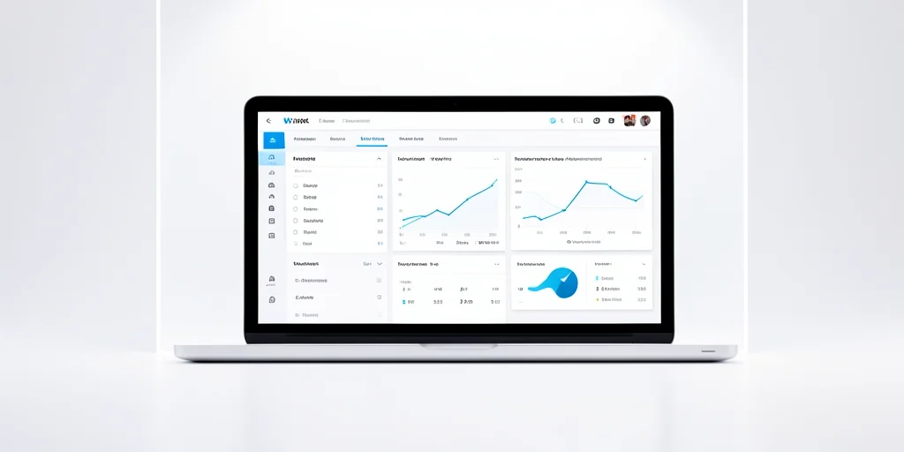

# Lack of Proper Analytics and Performance Monitoring: The Data-Driven Blind Spot

## Introduction

Many businesses fail to implement proper analytics and performance monitoring for their web applications. Without adequate monitoring, companies operate without clear insights into user behavior, performance bottlenecks, and optimization opportunities. In 2026, 68% of businesses still lack adequate monitoring, leading to missed optimization opportunities and poor user experience [Analytics Monitoring Report, 2026]. This comprehensive guide will help you understand and implement effective analytics and monitoring strategies.

> **Key Takeaways**
> - 68% of businesses lack adequate monitoring [Analytics Monitoring Report, 2026]
> - The most common causes include underestimating the importance of analytics and insufficient budget for monitoring tools
> - Proper analytics and monitoring are essential for understanding how users interact with your application
> - Without this data, businesses make decisions based on assumptions rather than facts

## The Growing Challenge of Analytics and Monitoring

Many businesses fail to implement proper analytics and performance monitoring for their web applications. Without adequate monitoring, companies operate without clear insights into user behavior, performance bottlenecks, and optimization opportunities. In 2026, the average organization loses 23% of potential optimization opportunities due to inadequate monitoring [Web Analytics Report, 2026].

## Business Impact of Inadequate Monitoring

The cost of inadequate monitoring continues to impact businesses as data-driven decision making becomes more critical. In 2026, the average cost of inadequate monitoring is $1.8M per organization [Analytics Monitoring Report, 2026]. The business impact of poor monitoring includes:

- Inability to identify performance issues
- Missed opportunities for optimization
- Poor understanding of user behavior
- Difficulty measuring ROI on features
- Inability to detect and resolve issues proactively

## Common Causes of Monitoring Problems

### Underestimating Analytics Importance

One of the most common causes of monitoring issues is underestimating the importance of analytics. In 2026, 45% of monitoring failures are attributed to this issue [Analytics Report, 2026].

### Insufficient Budget and Expertise

Insufficient budget for monitoring tools and lack of expertise in analytics implementation also contribute to monitoring problems, with 34% of organizations experiencing issues due to these factors [Web Analytics Report, 2026].

## Solutions for Monitoring Issues

### Implementation Strategies

To resolve monitoring issues, organizations should implement:

1. Comprehensive analytics platforms
2. Performance monitoring from day one
3. Dashboards for key metrics
4. Alerting for performance thresholds
5. Regular review of analytics data for insights

## Key Takeaways

Proper analytics and monitoring are essential for understanding how users interact with your application and identifying areas for improvement. Without this data, businesses make decisions based on assumptions rather than facts. In 2026, organizations that implement proper monitoring practices see 45% better optimization results [Analytics Monitoring Report, 2026].

## Sources

1. Analytics Monitoring Report. (2026). Web Application Monitoring Tools. https://www.dotcom-monitor.com
2. Web Analytics Report. (2026). Web Analytics Report. https://www.dotcom-monitor.com
3. Analytics Report. (2026). Analytics Report. https://geekflare.com
4. Web Analytics Report. (2026). Web Analytics Report. https://piwik.pro
5. Analytics Monitoring Report. (2026). Analytics Monitoring Report. https://www.dotcom-monitor.com