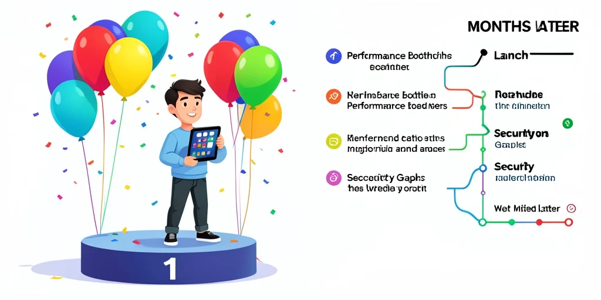

# Security and Performance Misconceptions: Debunking Web Development Myths

## Introduction

The most expensive problems in web development rarely come from bugs or bad code. They come from assumptions — beliefs that seem reasonable at the time but lead teams to defer critical work until it becomes a crisis. Security and performance are the two areas where dangerous misconceptions are most deeply entrenched, and most costly to correct.

This guide breaks down the myths that cause the most damage, explains why they persist, and gives you a practical framework for building products where security and speed are first-class concerns from day one — not emergency retrofits after launch.

> **Key Takeaways**
> - Security and performance debt compounds faster than technical debt — delaying both multiplies the cost of fixing them
> - The most common misconceptions are structural, not technical: teams believe the wrong things about *when* and *whose job* these concerns are
> - Retrofitting security into a shipped product is significantly more expensive than designing it in from the start
> - Performance problems discovered in production are always harder to fix than ones caught in development

## What Makes Security and Performance Misconceptions So Persistent?

Both security and performance share a trait that makes them uniquely prone to neglect: their absence is invisible until something goes wrong. A slow page doesn't break — it just quietly costs you conversions. A security gap doesn't announce itself — it waits. This creates a false sense of safety that reinforces bad assumptions.

The problem is structural as much as technical. Development cycles are measured against shipping features, not against response time percentiles or threat model coverage. When a sprint ends and the feature works, security and performance are easy to defer — they're not in the acceptance criteria, they don't show up in a failing test, and the people who will eventually pay for their absence (security teams, ops, future developers) aren't usually in the room when the decision to skip them is made.

Understanding this dynamic matters because the fix isn't purely technical. It requires changing how teams think about these concerns — treating them as design requirements, not quality polish.

## Is "We'll Add Security Later" Ever a Safe Strategy?

No — and it's one of the most common and costly assumptions in the industry. Security architecture is load-bearing. Decisions made early in the design of a system — how authentication is structured, whether data is encrypted at rest, how permissions are modeled, how user input flows through the application — are deeply embedded in the code by the time a product ships. Retrofitting proper security controls onto an existing system often requires rewriting the parts that needed to be right from the start.

The attack surface of a web application is also not static. It expands every time a new feature is added, a new dependency is introduced, or a new API endpoint is exposed. Each of those additions is a decision point where security should be considered. Deferring that consideration doesn't remove it from the equation — it just means you're making security decisions implicitly, without awareness, in the middle of decisions about something else.

Practically, this means designing your data model with privilege separation in mind, applying input validation at every trust boundary, using parameterized queries from the first line of database code, and treating authentication and authorization as infrastructure — not features to be added in a later sprint.

For applications running on Cloudflare Workers, this also means understanding where your trust boundaries are. Requests arrive at the edge, but that doesn't mean edge validation replaces origin validation. Defense in depth requires checking inputs at every layer, not just the first one.

## Does HTTPS Mean My Application Is Secure?

HTTPS is necessary but far from sufficient, and conflating transport security with application security is one of the most widespread misconceptions in the field. TLS encrypts data in transit between the client and server — it says nothing about what happens to that data once it arrives.

An application can be fully HTTPS and still be vulnerable to SQL injection, cross-site scripting (XSS), broken access control, insecure direct object references, or sensitive data exposure through misconfigured storage. The OWASP Top 10 — the industry's canonical list of the most critical web application security risks — contains essentially no vulnerabilities that HTTPS prevents. Every item on that list is about what your application does with requests once they arrive, not how those requests were transmitted.

This matters especially for API-driven architectures, which are now the norm. An API endpoint protected by TLS but missing proper authorization checks is vulnerable regardless of how secure the transport is. Every endpoint should independently verify that the authenticated user has permission to perform the requested operation on the requested resource — not assume that authentication implies authorization.

The practical baseline for web application security in 2026 goes well beyond HTTPS: implement a Content Security Policy header, set appropriate CORS policies, use `HttpOnly` and `Secure` flags on session cookies, sanitize and validate all input, and audit your dependency tree for known vulnerabilities on a regular schedule.

## Is Performance Something You Optimize After Launch?

This assumption costs more than almost any other. Performance problems discovered in production are always harder to fix because by the time you find them, they're woven into the architecture. A slow database query pattern baked into every page of an application requires touching every page to fix. A JavaScript bundle that grew unchecked throughout development becomes a refactoring project to split. Infrastructure that was never designed to handle real load requires re-architecture under live traffic pressure.

The misconception often comes from a misunderstanding of what "performance work" means. Teams think of it as a distinct phase — benchmarking, profiling, optimizing — that happens after the feature is complete. But most performance problems aren't introduced in an optimization phase; they're introduced incrementally during feature development, one overlooked query or unchecked dependency at a time.

The alternative is treating performance as a continuous constraint. Set bundle size budgets and fail CI if they're exceeded. Measure server response times in your staging environment before merging. Write database queries against realistic data volumes, not the 50-row development database. Profile your most critical user flows during development, not after users start complaining.

For Cloudflare Workers specifically, understanding the execution model matters for performance. Workers have a CPU time limit per request, and operations that would be fast in a traditional server environment — synchronous blocking I/O, large in-memory data structures — behave differently at the edge. Testing against the actual runtime environment during development, not just locally with Node, catches these differences before they become production incidents.

## Does More Infrastructure Solve Performance Problems?

Scaling infrastructure is often the first instinct when a site gets slow, and sometimes it's the right move — but it's expensive and frequently masks the real problem without fixing it. Doubling your server capacity doubles your bill. It does not double your database query efficiency, reduce your JavaScript bundle size, or eliminate the N+1 query pattern your ORM introduced three months ago.

Infrastructure scaling is appropriate when your application is architecturally sound but genuinely resource-constrained under load. It is not appropriate — or effective — as a substitute for fixing slow queries, reducing payload sizes, or eliminating unnecessary work on the critical rendering path.

The more important discipline is understanding *why* your application is slow before reaching for more infrastructure. A Cloudflare Worker that makes 10 sequential D1 queries to build a single response will be slow regardless of how much you scale it, because the latency is in the query round trips, not the compute. Batching those queries, caching aggressively at the edge, or restructuring the data access pattern will deliver far more improvement than any infrastructure change.

Measure first. Profile the actual bottleneck. Fix the cause, not the symptom.

## Is Security Just the Security Team's Responsibility?

In organizations that have a dedicated security team, there's a persistent and damaging belief that security is their job and developers just need to build features. This leads to security review being treated as a gate at the end of the development cycle — a checkpoint to pass, not a design input. By that point, fixing structural security issues is expensive, politically difficult, and often rushed.

Security is a property of the system, and systems are built by developers. Every decision a developer makes — how to handle user input, how to model access control, which dependencies to bring in, how to store credentials — is a security decision, whether it's recognized as one or not. Making those decisions well doesn't require a security background; it requires awareness of the most common failure patterns and a habit of asking the right questions during design.

The most effective security posture is one where security knowledge is distributed across the team, security requirements are written alongside feature requirements, and security review happens throughout development rather than as a final gate. Threat modeling doesn't need to be a formal process — even a brief conversation during design about "what could go wrong if someone tried to abuse this?" surfaces issues that would otherwise ship.

## FAQ

**How early should security be considered in a project?**
From the first design conversation. The data model, authentication strategy, and API surface are all security decisions. Waiting until code is written means the structural decisions have already been made — often poorly — and fixing them requires rewriting, not patching.

**What's the most common security mistake in modern web applications?**
Broken access control — failing to verify that an authenticated user has permission to access a specific resource — is consistently the top-ranked vulnerability in the OWASP Top 10. It's common because developers often implement authentication correctly but treat authorization as an afterthought.

**How do I know if my application has a performance problem before users complain?**
Set up performance monitoring and alerting in production that measures real user metrics: Largest Contentful Paint, server response time by route, and error rates. Synthetic tests in CI catch regressions before they deploy. Real User Monitoring shows you what actual users experience across diverse devices and networks.

**Can third-party scripts create security vulnerabilities?**
Yes. A compromised third-party script loaded on your page runs in the same origin as your application and can access cookies, local storage, and DOM content. A Content Security Policy limits what scripts can execute and where they can send data, which significantly reduces this attack surface.

**Is it worth doing a formal security audit for a small project?**
Even small projects benefit from at least an informal threat model and a dependency vulnerability scan. Tools like `npm audit` or `pnpm audit` flag known vulnerabilities in your dependency tree for free in seconds. The cost of not running them is a shipped application with a known, publicly documented vulnerability.

## Conclusion

Security and performance failures are almost always the result of deferred decisions, not missing expertise. The teams that ship secure, fast products aren't necessarily more skilled — they're more consistent about treating both as design requirements rather than cleanup tasks.

The myths debunked in this guide share a common thread: they create permission to delay. Recognizing them for what they are — rationalizations that defer risk without reducing it — is the first step toward building systems that hold up under real-world conditions.

**Key takeaways:**
- Security architecture is load-bearing — retrofit is always more expensive than designing it in from the start
- HTTPS protects transport; it says nothing about application-level security
- Performance problems compound during development and are hardest to fix in production
- More infrastructure does not fix inefficient code — profile before scaling
- Security is a property of the system and a shared responsibility across the team
- Both security and performance require continuous attention, not periodic reviews

## Sources

1. OWASP. (2026). OWASP Top Ten Web Application Security Risks. https://owasp.org/www-project-top-ten/
2. Google. (2026). Core Web Vitals. https://web.dev/vitals/
3. Cloudflare. (2026). Cloudflare Workers Documentation. https://developers.cloudflare.com/workers/
4. NIST. (2026). Secure Software Development Framework (SSDF). https://csrc.nist.gov/projects/ssdf
5. web.dev. (2026). Content Security Policy. https://web.dev/csp/