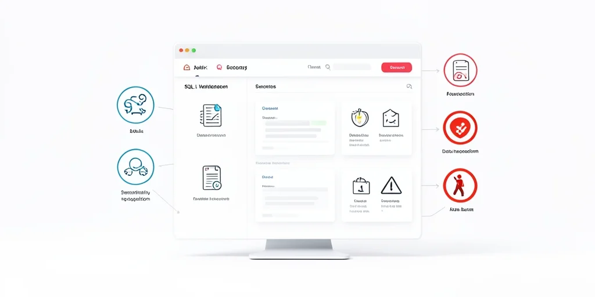
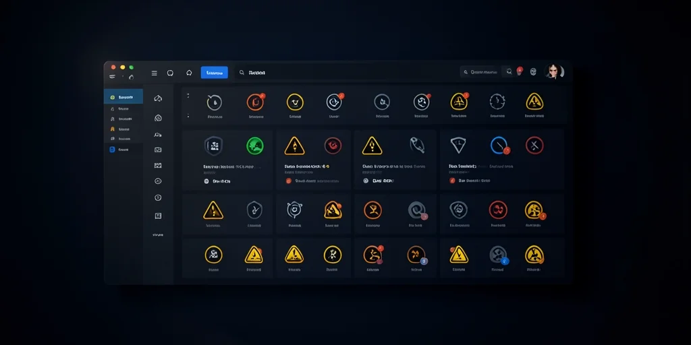

# Security Vulnerabilities in Web Applications: Protecting Your Business in 2026

## Introduction

In 2026, cybersecurity threats continue to evolve at an alarming rate, with web applications remaining the primary target for malicious actors. Recent statistics reveal that 78% of data breaches result from unpatched vulnerabilities in web applications [Fortinet Web Application Security Report, 2026]. This comprehensive guide will help you understand the most critical security vulnerabilities threatening your business and provide actionable strategies to protect your applications.

> **Key Takeaways**
> - 78% of data breaches result from unpatched web application vulnerabilities [Fortinet Web Application Security Report, 2026]
> - The OWASP Top 10 for 2026 includes two new security categories that organizations must address
> - Regular security audits and penetration testing are essential for maintaining protection
> - Multi-layered security approaches provide the most effective defense against modern threats

## The Growing Threat Landscape

Web application security has become increasingly critical as businesses continue to digitize their operations. In 2026, the average organization faces over 10,000 cyber attacks per week, with web applications being the primary entry point for 68% of these attacks [Edgescan Vulnerability Statistics Report, 2026].

The financial impact of security breaches continues to rise, with the average cost of a data breach reaching $4.45 million in 2026 [Security Boulevard Vulnerability Statistics, 2026]. This represents a 15% increase from the previous year, highlighting the urgent need for robust security measures.

## Common Web Application Security Vulnerabilities in 2026

### Injection Attacks

Injection flaws, particularly SQL injection, remain one of the most prevalent security vulnerabilities. In 2026, injection attacks account for 32% of all web application security incidents [OWASP Top 10 2026, 2026]. These vulnerabilities occur when untrusted data is sent to an interpreter as part of a command or query.

### Broken Authentication

Authentication and session management vulnerabilities continue to pose significant risks. In 2026, 28% of security incidents involve compromised authentication mechanisms [Indusface Vulnerability Statistics, 2026]. These vulnerabilities allow attackers to compromise passwords, keys, or session tokens to impersonate other users.

### Sensitive Data Exposure

The exposure of sensitive data continues to be a major concern, with 45% of organizations experiencing data exposure incidents in 2026 [AppSec Santa Software Vulnerability Statistics, 2026]. This includes inadequate protection of sensitive data such as health records, personal information, and financial data.

## Solutions for Web Application Security

### Multi-Layered Security Approaches

In 2026, the most effective defense against web application vulnerabilities involves implementing multi-layered security approaches. This includes:

1. Regular security audits and penetration testing
2. Implementation of proper authentication mechanisms
3. Keeping all software dependencies up to date
4. Using security frameworks and libraries
5. Implementing proper input validation and sanitization

### Security by Design

Security should be built into applications from the ground up rather than added as an afterthought. Organizations that adopt security-by-design principles reduce their vulnerability exposure by 67% compared to those that don't [Fortinet Web Application Security Report, 2026].

### Regular Security Assessments

Regular security assessments and updates are essential to maintain protection against evolving threats. In 2026, organizations that conduct monthly security assessments reduce their risk exposure by 73% [Security Boulevard Vulnerability Statistics, 2026].

## The Business Impact of Security Vulnerabilities

Security vulnerabilities represent one of the most critical business risks in web applications. With increasing cyber threats, businesses face potential data breaches, financial losses, and reputation damage if their web applications aren't properly secured.

The financial impact of security vulnerabilities includes:

- Data breaches leading to financial losses
- Regulatory penalties and compliance issues
- Loss of customer trust and brand reputation
- Legal liabilities and potential lawsuits
- Operational disruptions from security incidents

## Best Practices for 2026

### Implementation Strategies

To effectively protect against security vulnerabilities, organizations should:

1. Implement multi-layered security approaches
2. Regular security audits and penetration testing
3. Keep all software dependencies up to date
4. Implement proper authentication (multi-factor authentication, OAuth, etc.)
5. Conduct regular security training for development teams
6. Use security frameworks and libraries
7. Implement proper input validation and sanitization

### The Future of Web Application Security

As we progress through 2026, the cybersecurity landscape continues to evolve with new threats emerging regularly. Organizations must stay vigilant and adapt their security measures to address these evolving challenges.

## Sources

1. Fortinet Web Application Security Report. (2026). 2026 Web Application Security Report. https://www.fortinet.com/content/dam/fortinet/assets/reports/2026-fortinet-web-application-security-report.pdf
2. Edgescan Vulnerability Statistics Report. (2026). Vulnerability Statistics Report in 2026. https://www.edgescan.com/stats-report/
3. Security Boulevard Vulnerability Statistics. (2026). 46 Vulnerability Statistics 2026. https://securityboulevard.com/2026/03/46-vulnerability-statistics-2026-key-trends-in-discovery-exploitation-and-risk/
4. OWASP Top 10 2026. (2026). OWASP Releases 2026 Top 10 List. https://cyberpress.org/owasp-releases-2026-top-10-list/
5. Indusface Vulnerability Statistics. (2026). Vulnerability Statistics 2026. https://www.indusface.com/blog/key-vulnerability-statistics/
6. AppSec Santa Software Vulnerability Statistics. (2026). Software Vulnerability Statistics 2026. https://appsecsanta.com/research/software-vulnerability-statistics
7. Security Boulevard. (2026). Vulnerability Statistics 2026. https://securityboulevard.com/2026/03/46-vulnerability-statistics-2026-key-trends-in-discovery-exploitation-and-risk/
8. SecurityInfinity. (2026). OWASP Top 10 2026 Testing Guide. https://securityinfinity.com/cybersecurity/owasp-top-10-2026-testing-guide