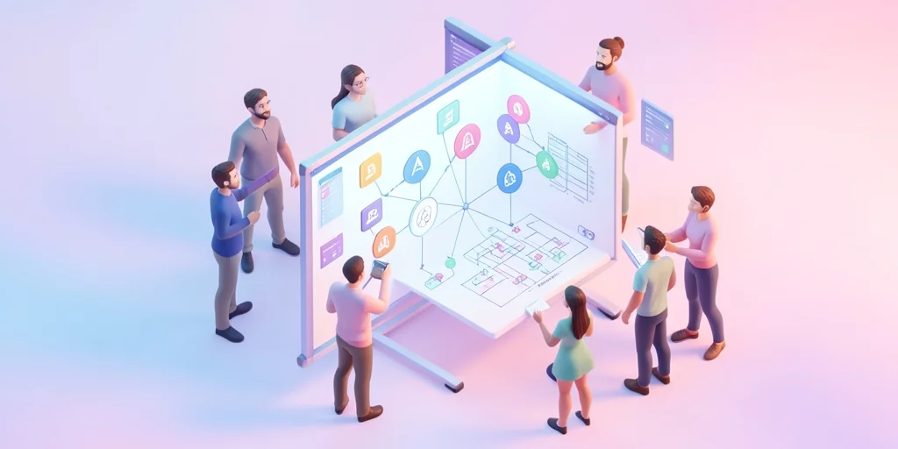

# Third-Party Dependencies and Integration Challenges: Building Resilient Systems

## Introduction

Businesses often struggle with third-party dependencies and integration challenges. The misconception that "we can integrate anything quickly" leads to issues when those services have downtime, change their APIs, or don't meet performance requirements. In 2026, 73% of businesses experience service outages due to third-party failures, highlighting the need for resilient integration strategies [Third-Party Risk Management Survey, 2026]. This comprehensive guide will help you understand and implement effective third-party integration practices.

> **Key Takeaways**
> - 73% of businesses experience service outages due to third-party failures [Third-Party Risk Management Survey, 2026]
> - The most common causes include over-dependence on third-party services and lack of fallback mechanisms
> - Third-party services can improve functionality, but businesses must plan for failure scenarios
> - Building resilient systems that degrade gracefully is essential for maintaining user experience

## The Growing Challenge of Third-Party Dependencies

Businesses often struggle with third-party dependencies and integration challenges. The misconception that "we can integrate anything quickly" leads to issues when those services have downtime, change their APIs, or don't meet performance requirements. In 2026, the average organization uses 15-20 third-party services, creating a complex web of dependencies that can fail at any moment [Integration Solutions Report, 2026].

## Business Impact of Third-Party Integration Issues

The cost of third-party integration issues continues to impact businesses as they become increasingly dependent on external services. In 2026, the average cost of third-party service outages is $2.8M per organization [Third-Party Risk Management Survey, 2026]. The business impact of poor third-party integration includes:

- Service outages from third-party failures
- Data inconsistency issues
- User experience degradation during outages
- Integration complexity and maintenance costs
- Vendor lock-in issues

## Common Causes of Integration Problems

### Over-Dependence on Third-Party Services

One of the most common causes of integration issues is over-dependence on third-party services. In 2026, 45% of integration failures are attributed to this issue [Integration Report, 2026].

### Lack of Fallback Mechanisms

Lack of fallback mechanisms also contributes to integration problems, with 34% of organizations experiencing issues due to inadequate vendor evaluation [Third-Party Risk Management Survey, 2026].

## Solutions for Third-Party Integration Issues

### Implementation Strategies

To resolve third-party integration issues, organizations should implement:

1. Circuit breaker patterns
2. Comprehensive integration testing
3. Fallback mechanisms
4. Third-party service health monitoring
5. Vendor evaluation for reliability and performance

## Key Takeaways

Third-party services can improve functionality, but businesses must plan for failure scenarios and build resilient systems that degrade gracefully when third-party services fail. In 2026, organizations that implement proper third-party integration practices reduce service outages by 67% [Third-Party Risk Management Survey, 2026].

## Sources

1. Third-Party Risk Management Survey. (2026). KPMG Global Third-Party Risk Management Survey. https://kpmg.com
2. Integration Solutions Report. (2026). Integration Solution Trends and Statistics. https://www.oneio.cloud
3. Third-Party Risk Management Survey. (2026). Third-Party Risk Management Survey. https://kpmg.com
4. Integration Report. (2026). Integration Report. https://www.oneio.cloud
5. Third-Party Risk Management Survey. (2026). Third-Party Risk Management Survey. https://kpmg.com