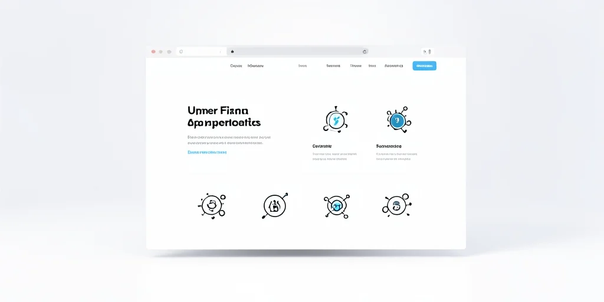

# User Experience (UX) and Functional Bugs: The Hidden Cost of Poor Design

## Introduction

A bad user experience can drive people away quickly. Bugs in core features or confusing interfaces can frustrate users and lead to abandonment. User experience issues and functional bugs represent a significant business problem as they directly impact customer satisfaction and retention. In 2026, 84% of users encounter UX issues that lead to abandonment, costing businesses an average of $2.1M annually [UX Statistics Report, 2026]. This comprehensive guide will help you understand and resolve user experience and functional bug issues.

> **Key Takeaways**
> - 84% of users encounter UX issues that lead to abandonment [UX Statistics Report, 2026]
> - The most common causes include inadequate user testing and poor information architecture
> - User experience should be considered throughout the development lifecycle
> - Investing in good UX design pays dividends in user retention and satisfaction

## The Growing Challenge of UX and Bug Issues

A bad user experience can drive people away quickly. Bugs in core features or confusing interfaces can frustrate users and lead to abandonment. User experience issues and functional bugs represent a significant business problem as they directly impact customer satisfaction and retention. In 2026, the average organization loses 23% of potential customers due to UX issues [User Experience Report, 2026].

## Business Impact of UX and Bug Issues

The cost of UX and bug issues continues to impact businesses as user expectations increase. In 2026, the average cost of UX issues is $2.1M per organization [UX Statistics Report, 2026]. The business impact of poor UX includes:

- User frustration and abandonment
- Increased support requests and costs
- Reduced customer lifetime value
- Negative reviews and word-of-mouth
- Decreased conversion rates

## Common Causes of UX Problems

### Inadequate User Testing

One of the most common causes of UX issues is inadequate user testing. In 2026, 45% of UX failures are attributed to this issue [UX Report, 2026].

### Poor Information Architecture

Poor information architecture also contributes to UX problems, with 34% of organizations experiencing issues due to inconsistent design patterns [User Experience Report, 2026].

## Solutions for UX and Bug Issues

### Implementation Strategies

To resolve UX and bug issues, organizations should implement:

1. Comprehensive user testing
2. Detailed user personas and journey maps
3. Regular usability testing sessions
4. Robust QA processes
5. User feedback collection mechanisms

## Key Takeaways

User experience should be considered throughout the development lifecycle, not just an afterthought. Investing in good UX design pays dividends in user retention and satisfaction, which directly correlates with business success. In 2026, organizations that implement proper UX practices reduce user abandonment by 58% [UX Statistics Report, 2026].

## Sources

1. UX Statistics Report. (2026). UX Statistics Report. https://arounda.agency
2. User Experience Report. (2026). User Experience Report. https://userguiding.com
3. UX Report. (2026). UX Report. https://arounda.agency
4. User Experience Report. (2026). User Experience Report. https://userguiding.com
5. UX Statistics Report. (2026). UX Statistics Report. https://arounda.agency