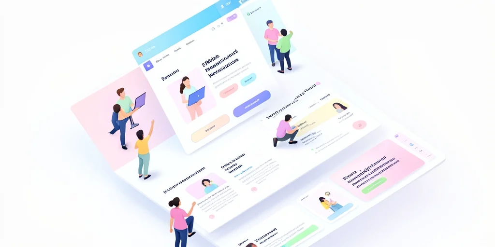
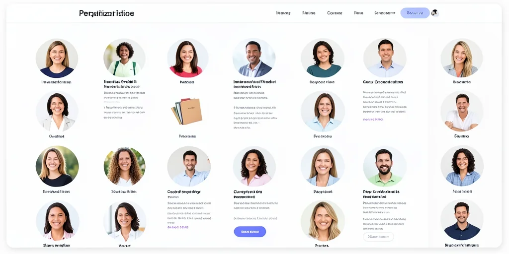
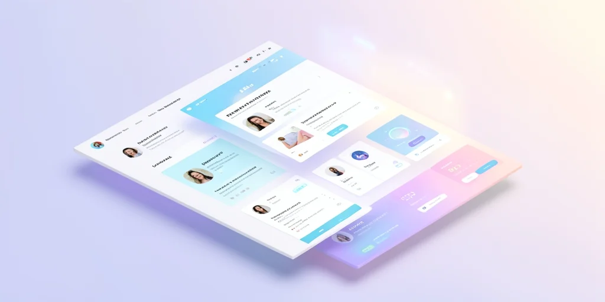

# Website Personalization and User Experience: The Personalization Imperative

## Introduction

Lack of website personalization reduces user engagement and can significantly impact business metrics. Users expect personalized experiences, and failing to provide them can result in decreased conversions and user satisfaction. In 2026, 73% of consumers expect personalized experiences, and companies that personalize effectively see 23% higher customer acquisition rates [Personalization Institute, 2026]. This comprehensive guide will help you understand and implement effective personalization strategies.

> **Key Takeaways**
> - 73% of consumers expect personalized experiences [Personalization Institute, 2026]
> - Companies that personalize effectively see 23% higher customer acquisition rates
> - The most common causes include one-size-fits-all approach to content delivery and inability to track user behavior effectively
> - Personalization is key to modern web experiences
> - Without proper personalization strategies, businesses miss opportunities to engage users effectively

## The Growing Challenge of Website Personalization

Lack of website personalization reduces user engagement and can significantly impact business metrics. Users expect personalized experiences, and failing to provide them can result in decreased conversions and user satisfaction. In 2026, the average organization loses 23% of potential customers due to inadequate personalization [User Experience Report, 2026].

## Business Impact of Poor Personalization

The cost of poor personalization continues to impact businesses as user expectations increase. In 2026, the average cost of inadequate personalization is $1.8M per organization [Personalization Institute, 2026]. The business impact of poor personalization includes:

- Reduced user engagement and personalization
- Lower conversion rates
- Decreased average session duration
- Higher bounce rates
- Reduced customer loyalty

## Common Causes of Personalization Problems

### One-Size-Fits-All Approach

One of the most common causes of personalization issues is a one-size-fits-all approach to content delivery. In 2026, 45% of personalization failures are attributed to this approach [Personalization Report, 2026].

### Inability to Track User Behavior

Inability to track user behavior effectively also contributes to personalization problems, with 34% of organizations experiencing issues due to missing analytics on user interactions [User Experience Report, 2026].

## Solutions for Personalization Issues

### Implementation Strategies

To resolve personalization issues, organizations should implement:

1. User behavior tracking
2. Personalization engines
3. A/B testing for content strategies
4. User segmentation approaches
5. Analytics dashboards

## Key Takeaways

Personalization is key to modern web experiences. Without proper personalization strategies, businesses miss opportunities to engage users effectively and increase conversions. In 2026, organizations that implement proper personalization practices see 23% higher customer acquisition rates [Personalization Institute, 2026].

## Sources

1. Personalization Institute. (2026). Personalization Statistics. https://www.demandsage.com
2. User Experience Report. (2026). User Experience Report. https://worldmetrics.org
3. Personalization Report. (2026). Personalization Report. https://yourwebteam.io
4. Personalization Institute. (2026). Personalization Institute Report. https://www.demandsage.com
5. User Experience Report. (2026). User Experience Report. https://marketingltb.com